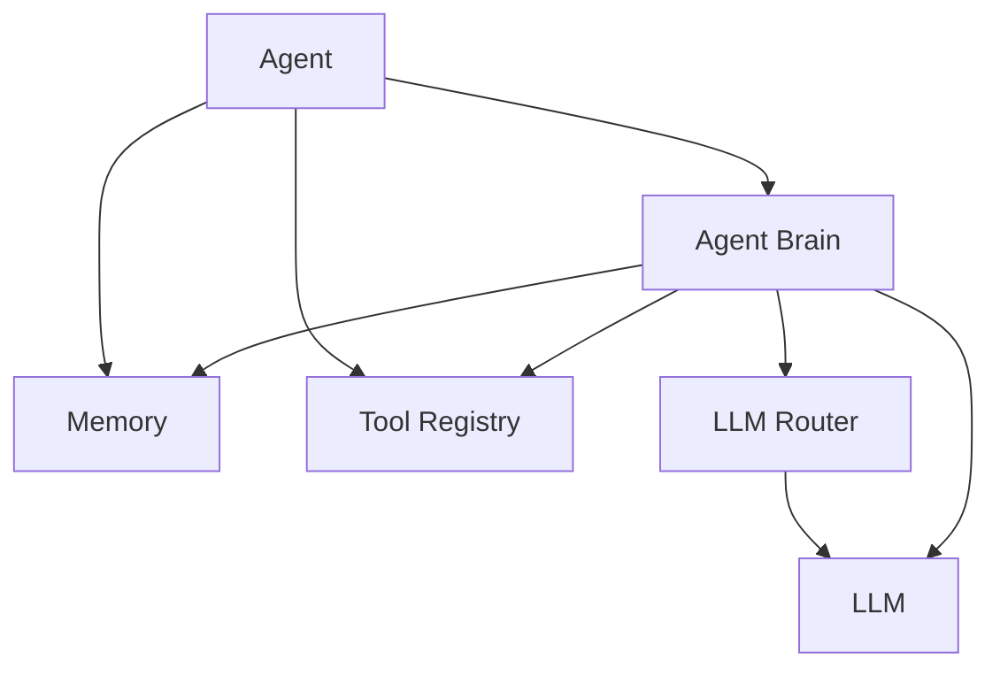
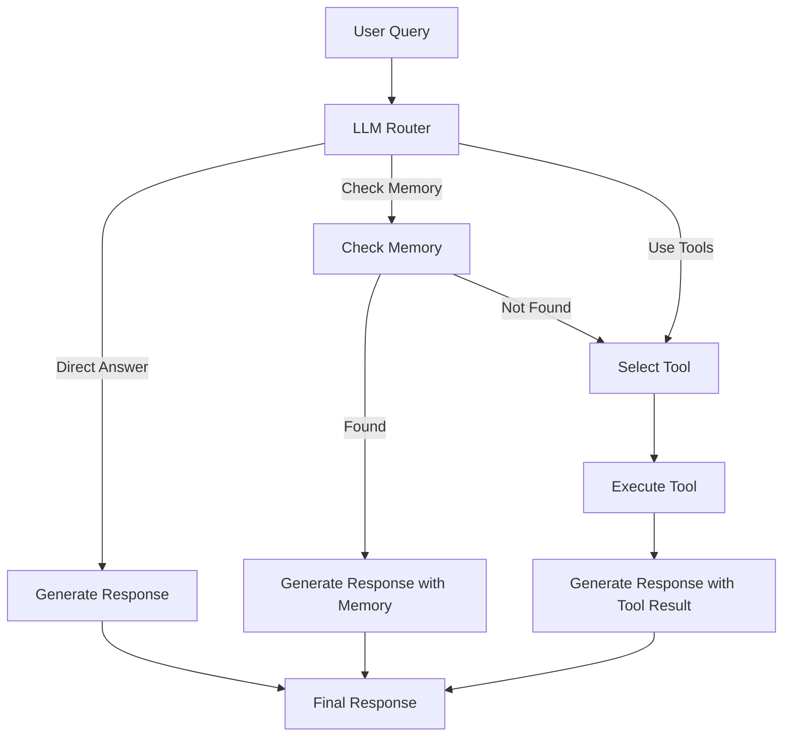

# Modular Agent Architecture

The SimplerLLM Agent system has been redesigned with a modular architecture that separates concerns and provides a more flexible and extensible framework for building AI agents.

## Architecture Overview

The new agent architecture consists of several key components:



### Core Components

1. **Agent**: The main class that users interact with, providing a simple API while using the modular architecture internally.

2. **Agent Brain**: The decision-making component that implements the workflow for processing user queries.

3. **Memory**: Stores conversation history and other state information.

4. **Tool Registry**: Manages the tools available to the agent.

5. **LLM Router**: Makes decisions about how to process queries (direct answer, use tools, check memory).

## Decision Tree Workflow

The agent uses a decision tree workflow to process user queries:



This workflow allows the agent to:

1. Answer directly when possible
2. Check memory for relevant information
3. Use tools when external information or computation is needed

## Using the Agent

### Basic Usage

```python
from SimplerLLM.language import LLM, LLMProvider
from SimplerLLM.agents import Agent

# Create an LLM instance
llm = LLM.create(
    provider=LLMProvider.OPENAI,
    model_name="gpt-4o",
    temperature=0.7,
)

# Create an agent
agent = Agent(llm=llm, verbose=True)

# Add tools
agent.add_tool(
    name="web_search",
    func=search_function,
    description="Search the web for information",
    parameters={
        "query": "The search query string",
        "num_results": "Maximum number of results to return"
    }
)

# Run the agent
response = agent.run("What is the capital of France?")
print(response)
```

### Setting Roles

The agent supports a flexible role system, from simple prompts to detailed role definitions:

#### Simple Role (String Prompt)

```python
# Set a simple role using a system prompt
agent.set_system_prompt("You are a helpful assistant that specializes in science topics.")

# Alternative syntax
agent.set_role("You are a helpful assistant that specializes in science topics.")
```

#### Advanced Role (AgentRole Object)

```python
from SimplerLLM.agents import AgentRole

# Create a detailed role
researcher_role = AgentRole(
    name="Science Researcher",
    description="An expert in scientific research and explanation",
    system_prompt="You are a scientific researcher who explains concepts clearly.",
    responsibilities=["Explain scientific concepts", "Provide accurate information"],
    constraints=["Avoid speculation", "Cite sources when possible"],
    allowed_tools=["web_search", "calculator"],
    priority_level=1,
    fallback_behavior="Provide general scientific guidance"
)

# Assign the role to the agent
agent.set_role(researcher_role)
```

## Memory System

The agent uses a modular memory system that can be extended with different implementations:

```python
from SimplerLLM.agents import BaseMemory

# Custom memory implementation
class VectorMemory(BaseMemory):
    # Implement the required methods
    # ...

# Use custom memory with agent
agent = Agent(llm=llm, memory=VectorMemory())
```

## Tool Registry

Tools are managed through a dedicated registry:

```python
from SimplerLLM.agents import ToolRegistry

# Create a tool registry
registry = ToolRegistry()

# Register tools
registry.register_tool(
    name="calculator",
    func=calculate,
    description="Perform calculations",
    parameters={"expression": "The mathematical expression to evaluate"}
)

# Execute a tool
result = registry.execute_tool("calculator", expression="2 + 2")
```

## Advanced Features

### Custom Brain Implementation

You can create custom brain implementations for specialized agent behaviors:

```python
from SimplerLLM.agents import AgentBrain

class ResearchBrain(AgentBrain):
    # Override methods to customize behavior
    # ...

# Use custom brain with agent components
brain = ResearchBrain(llm=llm, memory=memory, tool_registry=registry)
```

### Async Support

The agent system includes placeholder methods for async operation:

```python
# Run the agent asynchronously
response = await agent.run_async("What is the capital of France?")
```

## Future Extensions

The modular architecture is designed to support future extensions:

1. **Agent Swarms**: Teams of agents that collaborate on complex tasks
2. **Specialized Memory Systems**: Vector stores, knowledge graphs, etc.
3. **Advanced Orchestration**: Coordinating multiple agents and tools
4. **Role Learning**: Dynamically adapting roles based on experience

## Migration Guide

If you're using the previous agent implementation, the new system maintains the same external API, so your existing code should continue to work without changes.

To take advantage of the new features:

1. Use `set_role()` to assign roles to your agents
2. Explore the modular components for customization
3. Consider implementing custom memory systems for specialized use cases
